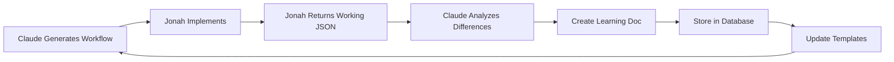

# Workflow Learnings System

## Purpose

This directory contains learnings from workflow implementations to continuously improve AI-generated workflow accuracy.

---

## How It Works

### 1. Workflow Generation
Claude generates workflow JSON based on requirements.

### 2. Implementation
Jonah imports the workflow to n8n and makes necessary adjustments to get it working.

### 3. Feedback Loop
Jonah sends back the **working JSON** to Claude.

### 4. Learning Analysis
Claude compares original vs. working JSON and documents all differences.

### 5. Continuous Improvement
Future workflows incorporate these learnings to reduce manual edits.

---

## File Structure

```
workflows/
├── {Category}/
│   ├── {WorkflowName}.n8n.json           # Latest working version
│   ├── {WorkflowName}.learnings.md       # Documented changes
│   └── {WorkflowName}.meta.json          # Metadata
├── LEARNING_TEMPLATE.md                   # Template for new learnings
└── README_LEARNINGS.md                    # This file
```

---

## Learning Categories

### 1. Credentials
- Credential structure and naming
- Required vs optional credentials
- Credential type selection

### 2. Expressions
- Syntax errors (missing `{{}}`, etc.)
- Node reference patterns
- Webhook data access (`$json.body` vs `$json`)
- First/all item access patterns

### 3. Property Names
- Incorrect property names
- Deprecated properties
- Version-specific properties

### 4. Type Mismatches
- String vs number conversions
- Array vs object issues
- JSONB casting

### 5. API Endpoints
- Wrong URLs
- Outdated API versions
- Incorrect parameters
- Query string formatting

### 6. Node Versions
- typeVersion incompatibilities
- Breaking changes between versions

---

## Process

### When Claude Sends a Workflow

1. Workflow saved to `workflows/{Category}/{Name}.n8n.json`
2. Documentation created if needed
3. User imports and tests

### When Jonah Returns Working JSON

1. **Save working version:**
   ```bash
   # Overwrite with working version
   workflows/{Category}/{Name}.n8n.json
   ```

2. **Claude analyzes differences:**
   - Compares original vs working
   - Identifies all changes
   - Categorizes issues

3. **Create learning document:**
   ```bash
   # New learning file
   workflows/{Category}/{Name}.learnings.md
   ```

4. **Store in database:**
   ```sql
   INSERT INTO learning_examples (
     user_input,
     expected_behavior,
     actual_behavior,
     lesson_summary,
     workflow_pattern,
     context
   ) VALUES (...);
   ```

5. **Update templates/skills:**
   - Fix common patterns
   - Update CLAUDE.md
   - Improve node configurations

---

## Metrics Tracked

| Metric | Description |
|--------|-------------|
| **Change Rate** | % of nodes that needed changes |
| **First-Try Success** | % of fields correct on first attempt |
| **Category Breakdown** | Changes by category (credentials, expressions, etc.) |
| **Time to Working** | Estimated time Jonah spent fixing |
| **Complexity** | Node count, connection count |

---

## Example Learning Entry

```markdown
# HubSpot_Bidirectional_Sync - Learnings

**Original JSON Sent:** 2026-01-18
**Working JSON Received:** 2026-01-18
**Changes Required:** 3

## Changes Made by Jonah

### 1. Credential Configuration
- **Original:** `credentials: {}`
- **Working:** `credentials: {"httpHeaderAuth": {"id": "45", "name": "HubSpot API"}}`
- **Lesson:** Include credential type and structure even with placeholder IDs

### 2. Salesmsg API Endpoint
- **Original:** `https://api.salesmessage.com/v2/messages`
- **Working:** `https://api.salesmessage.com/pub/v2.2/messages/87403488`
- **Lesson:** Salesmsg uses v2.2 with `/pub/` prefix and conversation ID in path

### 3. Expression Syntax
- **Original:** `={{ $json.stats.total_records }}`
- **Working:** `={{ $('📊 Compile Summary').first().json.stats.total_records }}`
- **Lesson:** Always reference specific node when accessing data from earlier nodes
```

---

## Benefits

### For Claude
- Learns from real implementations
- Reduces repetitive mistakes
- Improves accuracy over time
- Builds domain expertise

### For Jonah
- Fewer manual edits needed
- Faster workflow deployment
- Better initial workflow quality
- Documented patterns for reference

---

## Current Learnings

| Workflow | Date | Changes | Key Lesson |
|----------|------|---------|------------|
| {Example} | 2026-01-18 | 3 | Salesmsg API v2.2 format |

---

## Common Patterns Discovered

### Pattern: Webhook Data Access
**Wrong:** `{{ $json.fieldName }}`
**Right:** `{{ $json.body.fieldName }}`

### Pattern: Node References
**Wrong:** `{{ $json.previousData }}`
**Right:** `{{ $('Previous Node Name').first().json.previousData }}`

### Pattern: Postgres Parameters
**Wrong:** String concatenation in SQL
**Right:** Parameterized with `$1, $2, $3` and queryParameters

### Pattern: Salesmsg API
**Wrong:** `/v2/messages`
**Right:** `/pub/v2.2/messages/{conversation_id}`

---

## Continuous Improvement Workflow



---

## Questions?

See [CLAUDE.md](../CLAUDE.md) section "Continuous Improvement Protocol" for detailed instructions.
